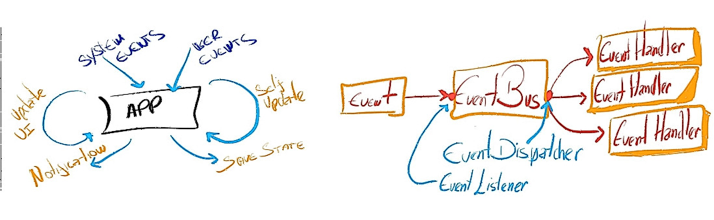

# eventbus4j
Simple Event-Driven Java Library



## Basic Usage

Event Registration:

```java
EventHandler<EventBoardChange> handler = EventBus.register(this, UIEvents.BOARD_CHANGE, event ->{
	System.out.println("Hi !!");
});
```

Send Events:

```
EventBus.notify(new UIEvents.EventBoardChange("board:"));
```

Define your events:

```java
public interface UIEvents {
  
  public static class EventBoardChange implements EventMessage {
	// ...
    public EventBoardChange(String board) {
      super();
      this.board = board;
    }
	// ....
  }
}
```

Unregister:

```
@Override
public void onClose() {
  EventBus.unregisterHandlers(this);
}
```

>  Note: **'this'**, can be any object, it is called Holder, and serves to unregister listeners. This is important to **avoid memory leaks**


***DONE !!!***

## Customization:

Create specific dispatchers "thread"  for your event:

```java
EventBus.configDispatcher(UIEvents.USER_CHANGE, new SingleThreadEventDispatcher(UIEvents.USER_CHANGE));
EventBus.configDispatcher(UIEvents.BOARD_CHANGE, new SingleThreadEventDispatcher(UIEvents.BOARD_CHANGE));
```

Avoid repeated events in a short time ( De-bounce )

```java
EventBus.configDispatcher(UIEvents.BOARD_CHANGE, new DebounceEventDispatcher(1000));
```

### Monitoring events

You can use a 'listener' to monitor events, know when they ran, allowing the example to create a log system.

> It is important that the listener is executed as quickly as possible, as it is executed on the main thread, and can delay other events.

```java
EventBus.addBusListener(new EventBusListener() {
    @Override
    public <E extends EventMessage> void onError( Exception e , E event , EventHandler<E> handler ) {
        // ...
    }
});

```
```java
public <E extends EventMessage> void beforeRun(E event, EventHandler<E> handler) {};
public <E extends EventMessage> void afterRun(E event, EventHandler<E> handler) {};
public <E extends EventMessage> void beforeDispatch( E event , EventHandler<E> handler , EventDispatcher eventDispatcher ) {};
public <E extends EventMessage> void eventIgnored( E event, EventDispatcher eventDispatcher, String reason ) {};
public <E extends EventMessage> void onError( Exception e , E event , EventHandler<E> handler ) {};
```

